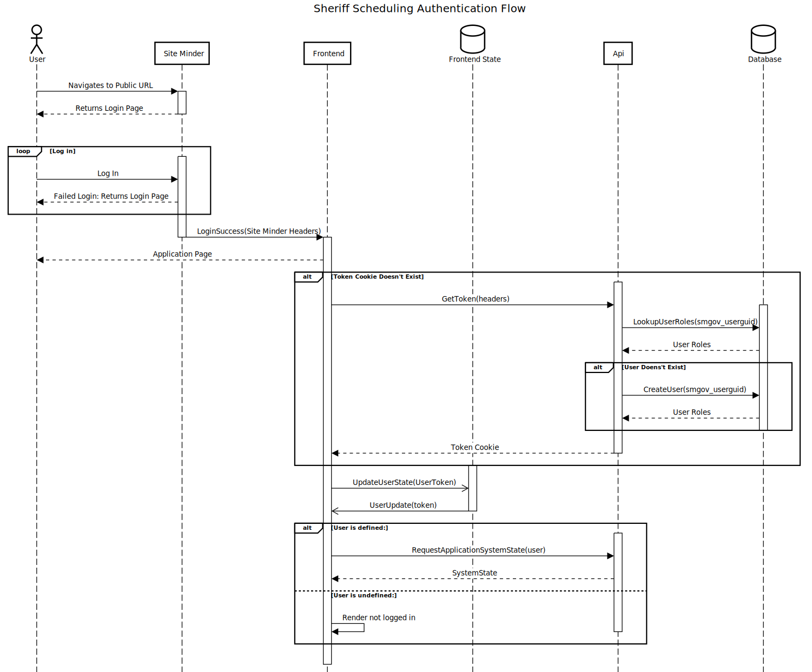

# Project Architecture 

## Technology

- [typescript](https://www.typescriptlang.org/) - Language of choice
- [node.js](https://nodejs.org/en/) - Runtime
- [koa](https://koajs.com/) - Web Framework for nodejs
- [tsoa](https://www.npmjs.com/package/tsoa) - API Generation Framework
- [typescript-ioc](https://www.npmjs.com/package/typescript-ioc) - Dependency Injection
- [jwt](https://jwt.io/) - Token Authentication
- [postgres](https://www.npmjs.com/package/pg) - Node postgres client
- [squel](https://hiddentao.com/squel/) - Declarative SQL Queries
- [Liquibase](https://www.liquibase.org/) - Database Migrations

## Directory Structure

```
/
    .github/                    - Github Meta pages
    .s2i/                       - s2i scripts for openshift
    .vscode/                    - vscode settings 
    config/                     - project configuration
    database/                   - liquibase & database migration scripts
    dist/                       - Location of built scripts
    docs/                       - project documentation
    openshift/                  - Openshift scripts and templates
    scripts/                    - Scripts for supporting development tasks related with the project
    src/                        - Source code
        client/                 - The API Client 
        common/                 - Code commone to client and server
        controllers/            - Controllers (i.e. endpoints)
        db/                     - Database Infrastructure
        infrastructure/         - Base classes and other utilities
        models/                 - Data Models used by controllers
        services/               - Services used by controllers
    templates/                  - Templates used in code generation
```
## Authentication

The following diagram shows the general authentication flow of the authentication from the frontend into the backend and back.




## Dependency Injection

In order to more cleanly facilitate per-request context and resources such as the current user, this project uses dependency injection and an IOC container that is created on a per-request basis.  

This project is using [typescript-ioc](https://www.npmjs.com/package/typescript-ioc).  Refer to their docs for more information.